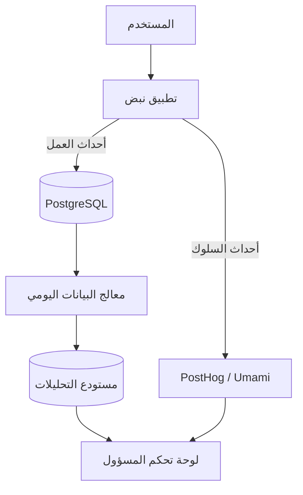

# 📊 نظام التحليلات المتقدم (Advanced Analytics System) - نبض

**المشروع:** نبض (Nabd SaaS)
**الهدف:** بناء محرك تحليلات داخلي يوفر رؤى عميقة حول سلوك المستخدمين، أداء الذكاء الاصطناعي، ونمو الأعمال.

---

## 1. المعمارية الهجينة (Hybrid Architecture)

نقترح معمارية تجمع بين **دقة البيانات الداخلية** و **قوة أدوات التتبع الخارجية**:



1.  **قاعدة البيانات التشغيلية (PostgreSQL):** للمقاييس الدقيقة (الإيرادات، عدد المستخدمين، الخطط).
2.  **محرك السلوك (PostHog - Self Hosted):** لتتبع النقرات، الخرائط الحرارية (Heatmaps)، ومسارات التحويل (Funnels) دون التأثير على خصوصية المستخدم (GDPR Compliant).

---

## 2. مصفوفة المقاييس (Metrics Matrix)

### أ. مقاييس النمو (Growth & Business) 📈
| المقياس | الوصف | الفائدة |
|---------|-------|---------|
| **MRR / ARR** | الإيرادات المتكررة الشهرية/السنوية | قياس صحة العمل المالي. |
| **Churn Rate** | معدل إلغاء الاشتراكات | معرفة مدى رضا العملاء. |
| **ARPU** | متوسط العائد لكل مستخدم | تحديد قيمة العميل. |
| **Conversion Rate** | نسبة تحول الزوار إلى مسجلين | قياس فعالية الصفحة الرئيسية. |

### ب. مقاييس الذكاء الاصطناعي (AI Performance) 🤖
| المقياس | الوصف | الفائدة |
|---------|-------|---------|
| **Token Usage** | استهلاك الرموز (الإدخال/الإخراج) | حساب التكلفة التشغيلية بدقة. |
| **Avg. Response Time** | متوسط زمن استجابة البوت | مراقبة جودة التجربة (Latency). |
| **Feedback Score** | تقييم المستخدم للرد (👍/👎) | تحسين جودة الـ Prompts. |
| **Model Preference** | النماذج الأكثر استخداماً | تحديد أي النماذج (Llama vs Gemma) يفضلها الناس. |

### ج. مقاييس التفاعل (Engagement) 💬
| المقياس | الوصف | الفائدة |
|---------|-------|---------|
| **DAU / MAU** | النشطون يومياً / شهرياً | قياس "لزوجة" المنتج (Stickiness). |
| **Avg. Session Length** | متوسط مدة الجلسة | هل يجد المستخدم قيمة في المحادثة؟ |
| **Retention Cohorts** | معدل عودة المستخدمين بعد أسبوع | فهم ولاء المستخدمين. |

---

## 3. خطة لوحة التحليلات (Dashboard Roadmap)

### المرحلة 1: التحليلات الأساسية (MVP)
*   [ ] بطاقات الإحصائيات الحية (Users, Messages, Revenue).
*   [ ] رسم بياني لاستهلاك الرموز (Token Usage Chart).
*   [ ] جدول "آخر النشاطات" (Live Feed).

### المرحلة 2: التحليلات السلوكية
*   [ ] دمج مكتبة رسوم بيانية متقدمة (**Recharts**).
*   [ ] عرض خريطة توزيع المستخدمين (Geographic Map) - تركيز على العراق.
*   [ ] تحليل الانحدار (Churn Prediction) بسيط.

### المرحلة 3: الذكاء الاصطناعي التنبئي
*   [ ] توقع الإيرادات للشهر القادم.
*   [ ] كشف الشذوذ (Anomaly Detection) في استخدام API لتجنب الهجمات.

---

## 4. نموذج البيانات المقترح (Data Schema)

إضافة جداول جديدة لقاعدة البيانات `schema.prisma`:

```prisma
model AnalyticsEvent {
  id        String   @id @default(cuid())
  userId    String?
  eventType String   // e.g., "chat_started", "subscription_upgraded"
  metadata  Json?    // { model: "llama-3", tokens: 150 }
  timestamp DateTime @default(now())

  @@index([eventType, timestamp])
}

model DailyMetrics {
  date      DateTime @id @db.Date
  totalTokens BigInt
  totalRevenue Decimal
  activeUsers Int
}
```

---

## 5. توصيات التنفيذ
للبدء فوراً دون تعقيد البنية التحتية، نوصي بـ:
1.  استخدام **Supabase** لتخزين الأحداث.
2.  بناء واجهة لوحة التحكم باستخدام مكوناتنا الحالية (`StatsCard`).
3.  استخدام **Recharts** لأنه خفيف ومتوافق تماماً مع Next.js.

هذا النظام سيحول "نبض" من مجرد أداة إلى **منصة تعتمد على البيانات (Data-Driven)** في اتخاذ القرارات.
